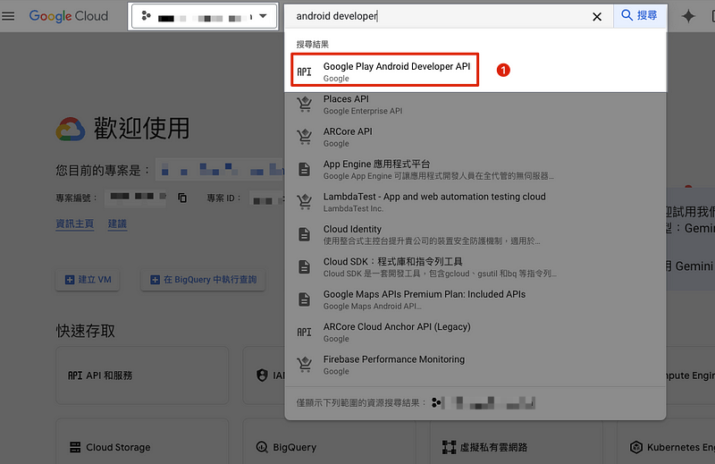
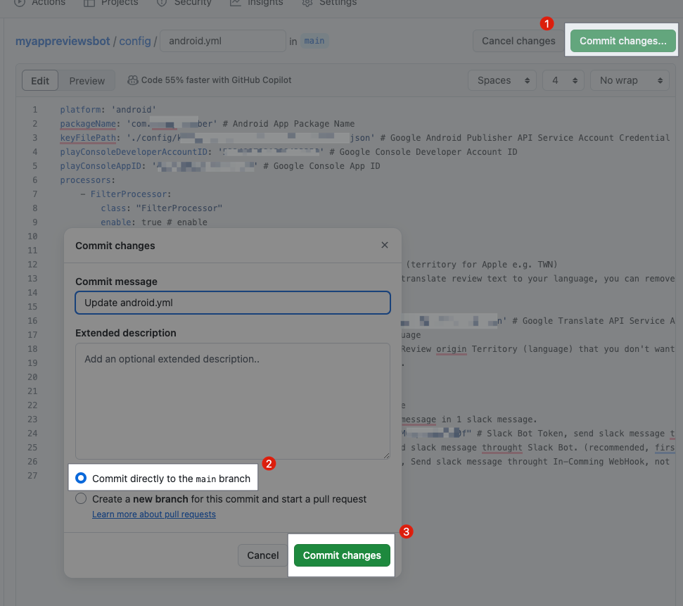
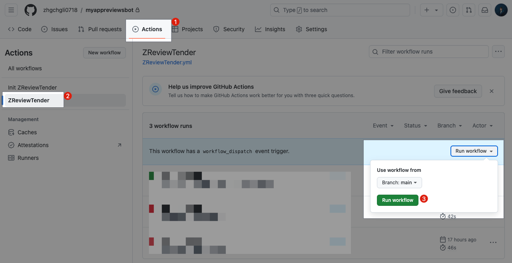

# \[Quick Start\! \] Github Action x ZReviewTender Free and Fast Deployment of Your App Store Review Monitoring Bot

Create a free, stable, and secure App review bot in three simple steps to keep track of the latest user reviews in real-time.

- [👉👉👉點此查看中文版，Quick Start! Github Action x ZReviewTender 免費快速部署你的 App 商城評價監控機器人
](https://medium.com/zrealm-ios-dev/quick-start-github-action-x-zreviewtender-%E5%85%8D%E8%B2%BB%E5%BF%AB%E9%80%9F%E9%83%A8%E7%BD%B2%E4%BD%A0%E7%9A%84-app-%E5%95%86%E5%9F%8E%E8%A9%95%E5%83%B9%E7%9B%A3%E6%8E%A7%E6%A9%9F%E5%99%A8%E4%BA%BA-0095528cf875)

](assets/0095528cf875/1*k8RswW3es9L19jIgbRDLpQ.png)

## [ZReviewTender](https://github.com/ZhgChgLi/ZReviewTender)

ZReviewTender — is an open-source App store review bot I created in 2022/08. It automatically fetches user reviews from the iOS App Store and Android Google Play Store and forwards them to a specified Slack Channel.

Additionally, it allows you to specify review fetching rules, integrate with Google Translate, Asana, Google Sheets, and supports custom operations.
## [Github Action](https://docs.github.com/en/actions)

Github Action is a CI/CD automation integration tool provided by Github. We can use our own machines as servers (Github Runner) or directly use the machines provided by Github to execute CI/CD and automation scripts.

### Costs and Limitations
- Using your own machines (Github Runner):
[No special costs, only maximum execution numbers, concurrency limits, and some API short-term maximum request limits.](https://docs.github.com/en/actions/hosting-your-own-runners/managing-self-hosted-runners/about-self-hosted-runners#usage-limits)
- [Using Github-provided machines:](https://docs.github.com/en/billing/managing-billing-for-github-actions/about-billing-for-github-actions#included-storage-and-minutes)


GitHub Free provides basic 500 MB Storage (for CI/CD Artifact) and 2,000 Minutes of execution time per month.

[**Note that due to machine cost issues:**](https://docs.github.com/en/billing/managing-billing-for-github-actions/about-billing-for-github-actions#minute-multipliers)
- If using Github's Windows machines, the consumed minutes equal actual minutes x 2
- If using Github's macOS machines, the consumed minutes equal actual minutes x 10


For detailed pricing calculations, please refer to the [official pricing calculator](https://github.com/pricing/calculator?feature=actions).

> [**_ZReviewTender_**](https://github.com/ZhgChgLi/ZReviewTender) **_Minutes per month consumption: approximately 120 minutes_** 

> _Only needs to run on basic billing Linux, each execution takes about ≤ 1 minute, by default it runs every 6 hours, spending 4 minutes a day, approximately 120 minutes a month, the free quota is more than enough._ 

> [**_ZReviewTender_**](https://github.com/ZhgChgLi/ZReviewTender) **_Storage consumption: 0_** 

> _No use of Artifact storage, so there is no storage cost._ 

## [Slack](https://slack.com/)

The internal communication software used by the company, a Slack App will be created and through this Slack App identity, the App Store review notifications will be forwarded to the designated channel.


## [ZReviewTender](https://github.com/ZhgChgLi/ZReviewTender) x [Github Action](https://docs.github.com/en/actions) x [Slack](https://slack.com/)

> _We use Github Action to execute the ZReviewTender script and forward the results to Slack. The Github Repo (Action) is just used as a carrier, so even if your main project does not use Github for hosting, you can still easily complete the ZReviewTender deployment by following the steps below. 🎉🎉🎉_

> **_I have successfully deployed it in different Apps of 5 different companies and it has been running stably and for free for at least 2 years._**

### Advantages:
- **Free**: [ZReviewTender](https://github.com/ZhgChgLi/ZReviewTender) is an open-source free service I created, deployed on [Github Action](https://docs.github.com/en/actions) using the free quota is more than enough. 
You don't need to spend money every month to buy App Review Bot or similar monthly review bot services.
- **Secure**: The credentials and keys used to fetch reviews are securely stored in your Github Private Repo, no one else has access to them. 
You no longer need to risk leaking important credentials and keys by uploading them to third-party services; [ZReviewTender](https://github.com/ZhgChgLi/ZReviewTender) is an open-source project, and all operations can withstand public scrutiny.
- **Reliable**: [ZReviewTender](https://github.com/ZhgChgLi/ZReviewTender) uses the latest official API to fetch review information, which is more accurate, stable, and reliable compared to other services that used to fetch reviews via RSS.

# Buy me coffee ❤️❤️❤️

](assets/0095528cf875/1*QCQqlZr6doDP-cszzpaSpw.png)

[https://www.buymeacoffee.com/zhgchgli](https://www.buymeacoffee.com/zhgchgli)

> [**_If this project has helped you, feel free to sponsor me a cup of coffee, thank you._**](https://www.buymeacoffee.com/zhgchgli)

# Quick Start! 🚀

> **_The entire setup process takes about 30 minutes, but only needs to be set up once. Unless the credentials and keys are changed, it can run stably and for free forever._** 🚀🚀🚀🚀🚀

## Step 1. Create a Slack App

If your organization already has a Slack App with `chat:write` or similar message sending permissions, you can reuse it without creating a new one.

### [**Go to the Slack Apps homepage:**](https://api.slack.com/apps)

](assets/0095528cf875/1*JDaxmORRL3ipdeA0ZaHW3w.png)

[https://api.slack.com/apps](https://api.slack.com/apps)

Click "Create New App" in the upper right corner.


1. Select: From scratch
2. Enter App Name: `ZReviewTender` or customize the Slack App name
3. Select the target Slack Workspace: Make sure you have the permission to add a Slack App in the chosen Workspace.
4. Create App

### **Add OAuth & Permissions Scopes:**
After creating the Slack app, go to the "OAuth & Permissions" tab to set up Scopes.


1. Select "OAuth & Permissions"
2. Scroll down to find the Scopes Section
3. Sequentially add the three necessary Scopes for the ZReviewTender Slack App:

```vbnet
chat:write
chat:write.public
links:write
```

### **Install App**
Go back to the Install App tab to install the Slack App into the Workspace.


1. Select "Install App"
2. Click "Install to _YOUR\_WORKSPACE_"
3. Click "Allow"


After installation, return to the Install App page to find the `Slack App Bot User OAuth Token`. Click "Copy" to copy it, **note it down for later use**.

### **Create a channel to receive review notifications:**


- Sidebar -> Channels -> Create -> Create channel
- Name: Enter the desired channel name


**Visibility:**
- Public: Open to everyone, no further action needed.
- **Private: Private channel,** ⭐️⭐️⭐️ **you need to add the newly created Slack App:**

#### **How to add Slack App to the channel:**


1. Click on the top \#channel name
2. Click "Settings"
3. Click "Add an App"


1. Search for the name of the Slack App you just created
2. Click "Add"


A prompt will appear in the channel indicating success. `ZReviewTender joined.`

> **_⭐️⭐️⭐️There is a known Slack Bug here. The newly created Slack App might not appear in the search immediately; you may need to wait a while. You can use a Public Channel first, as Public Channels do not require adding the Slack App to use._**

### **Get Channel ID:**
The final and most important step is to get the Channel ID for later configuration.


1. Click on the top \#channel name
2. At the bottom of About, there is a Channel ID information
3. **Note down the `Channel ID` for later configuration**

> **_Slack steps completed._**

— — —

### **Additional Information:**

**You can edit the Slack App name and icon in "Basic Information" \-\> "Display Information":**


Remember to click "Save Changes" at the bottom right corner to save your changes.

**If there are new additions to OAuth & Permissions Scopes, you need to click "reinstall your app" to reinstall it for the changes to take effect:**


## Step 2. Generate Apple App Store Connect API & Google Play Android Developer API credentials
### Apple App Store Connect API credentials

**iOS is relatively easier, we only need to get the following four pieces of information from App Store Connect:**

#### **Issuer ID:**


- App Store Connect \-\> Keys \-\> [App Store Connect API](https://appstoreconnect.apple.com/access/api)
- **Note down the `Issuer ID` for later configuration**

#### **Private Key ID & Private Key:**

Click the "+" button to add:


- Name: `ZReviewTender`
- Access: `App Manager`


- `Key ID` **for later configuration**
- **Click "Download API Key" to save and download the " `AuthKey_XXXXXXXXXX.p8` " file for later configuration.**

#### **App ID: \(The target App ID for fetching reviews\)**


App ID can be found in [App Store Connect](https://appstoreconnect.apple.com/apps) \-\> App Store \-\> General \-\> App Information \-\> `App ID`.
- **Note down the `App ID` for later configuration**

### Google Play Android Developer API credentials

Android is more complex, requiring you to first enable the API & create a Service Account in the Google Cloud Project associated with the App project, and then add the Service Account to Google Play Console and grant App permissions.

[**Go to Google Cloud Project:**](https://console.cloud.google.com/welcome)

Select the Google Cloud Project associated with the App project or create a new Project.

#### **Enable "Android Developer API":**




1. Search for "Android Developer API" and click to enter
2. Select "Enable"

**\[Optional\] You can also enable "Cloud Translation API":**


- After enabling, you can use the same Service Account credentials to integrate the review auto-translation feature
- **Please note: Cloud Translation API is not free, and there will be charges for language detection and translation!**
- **Please note: Cloud Translation API is not free, and there will be charges for language detection and translation!**
- **Please note: Cloud Translation API is not free, and there will be charges for language detection and translation!**

#### **Create Service Account:**


1. Search for "IAM"
2. Select "IAM & Admin"


1. Select "Service Account"
2. Select "Create Service Account"


1. Service Account Name: Enter a name, such as " `ZReviewTender` " or " `Google Play Review Bot` "
2. Service Account ID: Auto-filled, no need to change unless necessary. This will also be your Service Account Email.
3. Click "Done"

**Note down the Service Account Email address:**


- The list page will also display the Service Account Email address.
- **Note down the `Service Account Email` for later use**

**Create Service Account Key:**


1. Refresh the list page and click on the newly created Service Account.
2. Click "Add Key"
3. Click "Create new key"
4. Select "JSON" as the key type.
5. Click "Create"
6. **Save the downloaded `XXXX-XXXX.json` file for later use**

#### **Add the Service Account to Google Play Console and grant permissions to the target app:**

[**Go to Google Play Console:**](https://play.google.com/console/)


1. Click "Users and permissions"
2. Click "Invite new users" on the right


1. Enter the `Service Account Email` noted earlier in the Email address field.
2. App permissions -> Add app
3. Add the target app for fetching reviews.
4. Click "Invite user" to complete the invitation, no verification needed.

**Obtain Google Play Console Developer ID & App ID & Package Name:**


1. Click on the target app to enter the Dashboard.
2. **Note down the `Package Name` for later use**

Copy the Dashboard URL and find:

3. In the URL, /developers/ `XXX` **is your `Developer ID`. Note down this number for later use.**

4. In the URL, /app/ `XXX` **is your `App ID`. Note down this number for later use.**

> **_Credential setup complete._**

## Step 3. Github Action Deployment and Configuration

The exciting news is that I have packaged the tedious Github Repo and Github Action setup process into a Repo Template & Marketplace Github Action. You can complete the work by following these steps.

### **Go to: [ZReviewTender-deploy-with-github-action](https://github.com/ZhgChgLi/ZReviewTender-deploy-with-github-action):**

](assets/0095528cf875/1*LXuZQnLMsH-_ULX-DEiL9w.png)

[https://github.com/ZhgChgLi/ZReviewTender-deploy-with-github-action](https://github.com/ZhgChgLi/ZReviewTender-deploy-with-github-action)


- Repository name: Enter the Repo name you want
- **Private**: Since the Repo will store access keys, **be sure to set it as a Private Repo ⭐️⭐️⭐️**
- **Private**: Since the Repo will store access keys, **be sure to set it as a Private Repo ⭐️⭐️⭐️**
- **Private**: Since the Repo will store access keys, **be sure to set it as a Private Repo ⭐️⭐️⭐️**
- Click "Create repository"

> The author, contributors, and ZhgChgLi of ZReviewTender are not responsible for any loss caused by your use of ZReviewTender.

**Wait for the Repository to be created:**


**Confirm again that it is a Private Repo:**


- **Private**: Since the Repo will store access keys, **be sure to set it as a Private Repo ⭐️⭐️⭐️**
- **Private**: Since the Repo will store access keys, **be sure to set it as a Private Repo ⭐️⭐️⭐️**
- **Private**: Since the Repo will store access keys, **be sure to set it as a Private Repo ⭐️⭐️⭐️**

### **Enable Github Actions permissions:**
After the Repo is created, due to Github security settings, you need to go to Repo Settings to allow Github Actions to execute.


1. Repo -> Settings
2. Select "Actions" -> "General"
3. Actions permissions select "Allow all actions and reusable workflows"
4. Click "Save"
5. Workflow permissions select "Read repository contents and packages permissions"

**First run, initialize ZReviewTender:**


1. Repo -> Actions
2. Select "Init ZReviewTender"
3. Select "Run workflow"
4. Click "Run workflow"
5. Refresh the page

### **Wait for** `init ZReviewTender` **Action to complete:**


> _If an ❌ Error appears: Please recheck the Github Actions permissions settings mentioned earlier._

**After successful initialization, two new directories will appear on the Repo homepage:**


### **Upload the required certificate files:**


1. Enter the `/config` directory
2. Top right corner "Add file" -> "Upload files"


1. Upload the GCP Service Account `XXXX-XXXX.json` (for Android) and the App Store Connect `AuthKey_XXXXXXXXXX.p8` (for iOS) saved in Step 2 together.
2. Wait for the upload to complete
3. Select "Commit directly to the main branch"
4. Click "Commit changes"

### **Setting Apple (iOS):**


- Enter the `config/` directory, click on the `apple.yml` file


- Click on the top right "🖊️ Edit"


**Edit `apple.yml`, paste the following content and fill in the information noted down in the previous steps:**
```yaml
platform: 'apple'
appStoreConnectP8PrivateKeyFilePath: './config/AuthKey_XXXXXXXXXX.p8' # APPLE STORE CONNECT API PRIVATE .p8 KEY File Path
appStoreConnectP8PrivateKeyID: 'Private Key ID' # APPLE STORE CONNECT API PRIVATE KEY ID
appStoreConnectIssueID: 'Issuer ID' # APPLE STORE CONNECT ISSUE ID
appID: 'App ID' # APP ID
processors:
    - SlackProcessor: # Slack Processor, resend App Review to Slack.
        class: "SlackProcessor"
        enable: true # enable
        slackTimeZoneOffset: "+08:00" # Review Created Date TimeZone
        slackAttachmentGroupByNumber: "1" # 1~100, how many review message in 1 slack message.
        slackBotToken: "Slack App Bot User OAuth Token" # Slack Bot Token, send slack message through Slack Bot.
        slackBotTargetChannel: "Target Channel ID" # Slack Bot Token, send slack message through Slack Bot. (recommended, first priority)
        slackInCommingWebHookURL: "" # Slack In-Coming WebHook URL, Send slack message through In-Coming WebHook, not recommended, deprecated.
```
- `appStoreConnectP8PrivateKeyFilePath` : 
Enter `./config/AuthKey_XXXXXXXXXX.p8` (Step 2. App Store Connect saved `AuthKey_XXXXXXXXXX.p8` file name)
- `appStoreConnectP8PrivateKeyID` : Step 2. App Store Connect noted `Private Key ID`
- `appStoreConnectIssueID` : Step 2. App Store Connect noted `Issuer ID`
- `appID` : Step 2. App Store Connect noted target App's `App ID`
- `slackBotToken` : Enter Step 1. noted `Slack App Bot User OAuth Token`
- `slackBotTargetChannel` : Enter Step 1. noted target `Channel ID`


1. After editing, click on the top right "Commit changes…"
2. Select "Commit directly to the main branch"
3. Click "Commit changes"


### **Setting Android:**


- Enter the `config/` directory and click on the `android.yml` file


- Click on the "🖊️ Edit" button in the upper right corner

**Edit `android.yml`, paste the following content, and fill in the information noted down from the previous steps:**
```yaml
platform: 'android'
packageName: 'Package Name' # Android App Package Name
keyFilePath: './config/XXXX-XXXX.json' # Google Android Publisher API Service Account Credential .json File Path
playConsoleDeveloperAccountID: 'Developer ID' # Google Console Developer Account ID
playConsoleAppID: 'App ID' # Google Console App ID
processors:
- SlackProcessor: # Slack Processor, resend App Review to Slack.
        class: "SlackProcessor"
        enable: true # enable
        slackTimeZoneOffset: "+08:00" # Review Created Date TimeZone
        slackAttachmentGroupByNumber: "1" # 1~100, how many review message in 1 slack message.
        slackBotToken: "Slack App Bot User OAuth Token" # Slack Bot Token, send slack message through Slack Bot.
        slackBotTargetChannel: "Target Channel ID" # Slack Bot Token, send slack message through Slack Bot. (recommended, first priority)
        slackInCommingWebHookURL: "" # Slack In-Coming WebHook URL, Send slack message through In-Coming WebHook, not recommended, deprecated.
```
- `packageName`: Step 2. Google Play Console backend noted `Package Name`
- `keyFilePath`: Enter `./config/XXXX-XXXX.json` (Step 2. GCP IAM saved `XXXX-XXXX.json` Service Account key file name)
- `playConsoleDeveloperAccountID`: Step 2. Google Play Console backend noted `Developer ID`
- `playConsoleAppID`: Step 2. Google Play Console backend noted `App ID`
- `slackBotToken`: Enter Step 1. noted `Slack App Bot User OAuth Token`
- `slackBotTargetChannel`: Enter Step 1. noted `Channel ID` to send to



1. After editing, click on the "Commit changes…" button in the upper right corner
2. Choose "Commit directly to the main branch"
3. Click "Commit changes"

> **_Setup complete!_** 🚀🚀🚀🚀

## **Verify if the setup is successful:**

We can manually run it once to confirm the setup is correct.



1. Repo -> Actions
2. Select "ZReviewTender"
3. Select "Run workflow"
4. Click "Run workflow"
5. Refresh the page

**Waiting** for `ReviewTender` **Action to complete:**


### **Verification successful 🎉🎉🎉🎉**


> _If ❌ Error occurs, or Slack Channel does not receive the activation message: please recheck the previous configuration file content for correctness._

## Completed **🎉🎉🎉**


Now you can rely on this free and reliable App review bot to keep track of the latest user reviews at all times!
#### Buy me coffee ❤️❤️❤️

](assets/0095528cf875/1*QCQqlZr6doDP-cszzpaSpw.png)

[https://www.buymeacoffee.com/zhgchgli](https://www.buymeacoffee.com/zhgchgli)

> [**_If this project has helped you, feel free to sponsor me a cup of coffee, thank you._**](https://www.buymeacoffee.com/zhgchgli)

## Other Settings
### Adding Filter Function

Only forward reviews that meet the criteria.
```yaml
    - FilterProcessor:
        class: "FilterProcessor"
        enable: true # enable
        keywordsInclude: [] # keywords you want to filter out
        ratingsInclude: [] # ratings you want to filter out
        territoriesInclude: [] # territories you want to filter out (territory for Apple e.g. TWN)
```
- Just add the `FilterProcessor` settings in the `processors` section of `/config/apple.yml` or `/config/android.yml`.

### Adding Auto-Translation Function

Automatically translate reviews that are not in your language using the Google Cloud Translation API (costs may apply).
- **Please ensure that the GCP Project associated with the Service Account created in Step 2 has the "Cloud Translation API" enabled**
- The settings for `apple.yml` and `android.yml` are slightly different

`apple.yml:`
```bash
    - GoogleTranslateProcessor: # Google Translate Processor, will translate review text to your language, you can remove whole block if you don't need it.
        class: "GoogleTranslateProcessor"
        enable: true # enable
        googleTranslateAPIKeyFilePath: './config/XXXX-XXXX.json' # Google Translate API Service Account Credential .json File Path
        googleTranslateTargetLang: 'zh-TW' # Translate to what Language
        googleTranslateTerritoriesExclude: ["TWN","CHN"] # Review origin Territory that you don't want to translate. (territory for Apple e.g. TWN)
```
- `./config/XXXX-XXXX.json` (Step 2. GCP IAM saved `XXXX-XXXX.json` Service Account key file name)

`android.yml:`
```bash
    - GoogleTranslateProcessor: # Google Translate Processor, will translate review text to your language, you can remove whole block if you don't need it.
        class: "GoogleTranslateProcessor"
        enable: true # enable
        googleTranslateAPIKeyFilePath: './config/XXXX-XXXX.json' # Google Translate API Service Account Credential .json File Path
        googleTranslateTargetLang: 'zh-TW' # Translate to what Language
        googleTranslateTerritoriesExclude: ["zh-Hant","zh-Hans"] # Review origin Territory (language) that you don't want to translate. (language for android e.g. zh-Hant, en)
```
- `./config/XXXX-XXXX.json` (Step 2. GCP IAM saved `XXXX-XXXX.json` Service Account key file name)

#### **Complete Combination Example:**
```yaml
platform: 'android'
packageName: '' # Android App Package Name
keyFilePath: '' # Google Android Publisher API Service Account Credential .json File Path
playConsoleDeveloperAccountID: '' # Google Console Developer Account ID
playConsoleAppID: '' # Google Console App ID
processors:
    - FilterProcessor:
        class: "FilterProcessor"
        enable: true # enable
        keywordsInclude: [] # keywords you want to filter out
        ratingsInclude: [] # ratings you want to filter out
        territoriesInclude: [] # territories you want to filter out (territory for Apple e.g. TWN)
    - GoogleTranslateProcessor: # Google Translate Processor, will translate review text to your language, you can remove whole block if you don't need it.
        class: "GoogleTranslateProcessor"
        enable: true # enable
        googleTranslateAPIKeyFilePath: '' # Google Translate API Service Account Credential .json File Path
        googleTranslateTargetLang: 'zh-TW' # Translate to what Language
        googleTranslateTerritoriesExclude: ["zh-Hant","zh-Hans"] # Review origin Territory (language) that you don't want to translate. (language for android e.g. zh-Hant, en)
    - SlackProcessor: # Slack Processor, resend App Review to Slack.
        class: "SlackProcessor"
        enable: true # enable
        slackTimeZoneOffset: "+08:00" # Review Created Date TimeZone
        slackAttachmentGroupByNumber: "1" # 1~100, how many review messages in 1 slack message.
        slackBotToken: "" # Slack Bot Token, send slack message through Slack Bot.
        slackBotTargetChannel: "" # Slack Bot Token, send slack message through Slack Bot. (recommended, first priority)
        slackInCommingWebHookURL: "" # Slack In-Coming WebHook URL, Send slack message through In-Coming WebHook, not recommended, deprecated.
```

**Save the adjusted file as `.yml` following these steps:**


1. After editing, click "Commit changes…" in the upper right corner.
2. Select "Commit directly to the main branch."
3. Click "Commit changes."

### Execution Parameter Settings

You can edit the `ZReviewTender.yml` file to set execution parameters.


1. Repo -> Actions
2. Click "ZReviewTender"
3. Click "`ZReviewTender.yml`"
4. Click the top right "🖊️ Edit"

```yaml
name: ZReviewTender
on:
  workflow_dispatch:
  schedule:
    - cron: "15 */6 * * *" #check new review every 6 hour.

jobs:
  ZReviewTender:
    runs-on: ubuntu-latest
    steps:
    - name: ZReviewTender Automatic Bot
      uses: ZhgChgLi/ZReviewTender@main
      with:
        command: '-r'
```
#### Adjust the check frequency (How often to fetch new reviews?)

Adjust the settings in `cron: "15 */6 * * *"`.

**Parameters use Crontab notation, you can use [the following website](https://crontab.guru/) to generate the desired settings:**

](assets/0095528cf875/1*iWYVPC8AYalzLiRiQdd_yg.png)

[https://crontab.guru/](https://crontab.guru/)
#### Adjust the execution script

Adjust the settings in `command: "-r"`.
- `-r`: Check reviews for both Android and Apple (iOS)
- `-a`: Only check reviews for Apple (iOS)
- `-g`: Only check reviews for Android

**After adjustments:**


1. After editing, click the top right "Commit changes…"
2. Select "Commit directly to the main branch"
3. Click "Commit changes"

#### Temporarily stop checking


1. Repo -> Actions
2. Select "ZReviewTender"
3. Click the right "…"
4. Select "Disable workflow"

### Issue Reporting and Feature Suggestions

[](https://github.com/ZhgChgLi/ZReviewTender)

If you have any feature suggestions or issues, please go to the above Github Repo to create an Issue report, thank you.
